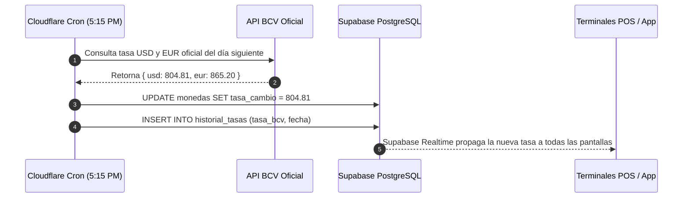

# Documento de Arquitectura y Plan Maestro de Desarrollo: Tesla Fire ERP / POS

> **Sistema Integral de Gestión Empresarial, Punto de Venta (POS) y Administración Fiscal Multimoneda**  
> **Target Stack:** React 18 + TypeScript + Vite + TailwindCSS + Supabase + Cloudflare Pages + Resend + Cron Serverless  
> **Versión:** 1.2.0  
> **Fecha de Actualización:** 2026-09-08  

---

## 1. Visión General y Arquitectura Cloudflare + Supabase + Resend

El sistema **Tesla Fire** está diseñado como una Single Page Application (SPA) de alto rendimiento en **TypeScript**, alojada globalmente en **Cloudflare Pages** y respaldada por la infraestructura en la nube de **Supabase** (PostgreSQL, Auth, Storage, Realtime y Edge Functions), con automatizaciones mediante **Cloudflare Cron Triggers / GitHub Actions** y mensajería transaccional con **Resend**.

```
┌────────────────────────────────────────────────────────────────────────┐
│                        CLOUDFLARE EDGE NETWORK                         │
│  Cloudflare Pages (Global CDN · 0ms Cold Start · Cache de Assets Web)  │
│  SPA Routing: /* -> /index.html 200 (Vite + React 18 + TypeScript)    │
│  Cloudflare Cron Triggers: Workers programados para tareas diarias    │
└───────────────────┬───────────────────────────────┬────────────────────┘
                    │ HTTPS / WSS                   │ API REST
                    ▼                               ▼
┌──────────────────────────────────────┐  ┌──────────────────────────────┐
│          SUPABASE PLATFORM           │  │     RESEND TRANSACTIONAL     │
│  ┌────────────────┐ ┌──────────────┐ │  │ 3,000 correos/mes gratis     │
│  │ Supabase Auth  │ │PostgreSQL 15 │ │  │ • Facturas / Recibos PDF     │
│  │(JWT / Roles)   │ │(Kardex/Ventas│ │  │ • Cierre de Caja al Dueño    │
│  └────────────────┘ └──────────────┘ │  │ • Alertas de Stock Crítico   │
│  ┌────────────────┐ ┌──────────────┐ │  │ • Recordatorios de Cobro     │
│  │Supabase Storage│ │  pg_cron     │ │  └──────────────────────────────┘
│  │(Comprobantes)  │ │ (Mantenim.)  │ │
│  └────────────────┘ └──────────────┘ │
└──────────────────────────────────────┘
```

### Ventajas del Stack 100% Gratuito y Escalable
1. **Cloudflare Pages (Tier Gratis):** Despliegue continuo con tiempos de carga inferiores a 50ms en cualquier punto geográfico, compresión Brotli automática, HTTPS administrado y ancho de banda ilimitado sin costo.
2. **Cloudflare Workers Cron Triggers (100,000 peticiones/día gratis):** Ejecución de tareas programadas en el edge (tasa BCV, revisiones de inventario) sin necesidad de un servidor VPS activo.
3. **Supabase (Tier Gratis):** Base de datos relacional PostgreSQL con RLS, sincronización en tiempo real entre cajas (`Supabase Realtime`) y almacenamiento de comprobantes bancarios.
4. **Resend (Tier Gratis: 3,000 correos/mes y 100/día):** Entrega inmediata de comprobantes en PDF, reportes ejecutivos a gerencia y alertas automáticas con entregabilidad garantizada.
5. **GitHub Actions (Tier Gratis: 2,000 minutos/mes):** Backups diarios cifrados de la base de datos para máxima tranquilidad del emprendedor.

---

## 2. Auditoría del Código Existente: Qué se Reutiliza y Qué se Adapta

El proyecto actual ya cuenta con una arquitectura base sólida en React + TypeScript con Supabase. **No es necesario reescribir desde cero**, sino reutilizar la lógica ya probada, adaptando los esquemas, interfaces y estilos hacia la identidad Tesla Fire.

### Tabla Comparativa de Reutilización

| Componente / Archivo Existente | Módulo Tesla Fire Correspondiente | Estado / Grado de Reutilización | Acciones Específicas Requeridas |
| :--- | :--- | :--- | :--- |
| `src/contexts/CurrencyContext.tsx` | **Header Global & Tasas (BCV / Paralelo)** | **90% Reutilizable** | Extender para soportar dos tasas simultáneas: Tasa Oficial BCV y Tasa Paralela. Alimentar el chip oscuro del header persistente (`Bs. 804,81`). |
| `src/components/admin/AdminLayout.tsx` | **Shell General & Sidebar SPA** | **100% Adaptado** | Implementado con submenús colapsables acordeón (`Inventario`, `Ventas`, `Compras`, `CXP`, `CXC`, `Bancos`, etc.), badges y paleta Tesla Fire (`#080A0C`, `#1B1F23`, `#00E5FF`). |
| `src/pages/admin/Productos.tsx` & `ProductModal.tsx` | **Inventario → Productos** | **80% Reutilizable** | Ya cuenta con CRUD, buscador, ordenamiento y exportación/importación Excel (`xlsx`). Agregar campos: `codigo_barra`, `precio_mayor_usd`, `es_servicio`, `es_varios`, `aplica_iva` y relación con `producto_stock` por tienda. |
| `src/pages/admin/Categorias.tsx` & `CategoryManagerModal.tsx` | **Configuración → Grupos / Categorías** | **95% Reutilizable** | Reutilizado como "Gestión de Grupos" en la ruta `/admin/configuracion/categorias`. |
| `src/pages/admin/Dashboard.tsx` | **Dashboard Principal** | **70% Reutilizable** | Reutiliza las consultas agregadas a Supabase (`productos`, `ordenes`). Reemplazar el layout visual por las 4 KPI Cards (Divisa cobrada por moneda, CXC pendiente, Inventario valorizado, Stock crítico) y el bloque consolidado de Ventas por Tienda. |
| `src/pages/admin/Ordenes.tsx` | **Ventas → Factura Fiscal & Nota de Entrega** | **75% Reutilizable** | Reutiliza la tabla de listado, modal de detalle de pedido, estados (`pendiente`, `completada`, `cancelada`), notas administrativas y desglose JSONB. Extender para diferenciar entre Factura Fiscal y Nota de Entrega. |
| `src/pages/admin/CRM.tsx` | **Ventas → Clientes** | **85% Reutilizable** | Reutiliza la tabla de clientes, búsqueda, filtros, historial de transacciones y cálculo de `total_inversion`. Agregar campos de límite de crédito, días de crédito y Billetera (Saldo a Favor). |
| `src/pages/admin/Usuarios.tsx` | **Administración → Usuarios & Seguridad** | **90% Reutilizable** | Ya cuenta con roles, log de actividad, pestaña de seguridad y asignación de permisos. Añadir el campo de `tienda_id` para restringir el acceso por sucursal. |
| `src/pages/admin/Configuracion.tsx` | **Configuración → Datos Empresa & Precios** | **90% Reutilizable** | Ya implementa persistencia clave-valor en Supabase. Añadir llaves para RIF, razón social, alícuota IGTF (%), medios de impresión y tienda principal. |
| `src/lib/supabase/client.ts` | **Conector Supabase** | **100% Reutilizable** | Ya configurado y listo para conectarse a cualquier proyecto Supabase mediante variables de entorno. |
| `src/hooks/useAuth.tsx` | **Control de Acceso y Roles** | **90% Reutilizable** | Incorporar permisos específicos para emisión de documentos: `canEmitFacturaFiscal`, `canEmitNotaEntrega`, `canDoAjustes`. |

---

## 3. Automatizaciones Serverless Gratuitas (Cloudflare Cron Triggers & GitHub Actions)

Para que el sistema funcione en piloto automático sin que el emprendedor deba preocuparse por tareas manuales:



### 3.1. Los 5 Cron Jobs Indispensables

#### Cron 1: Scraper Automático de Tasa BCV (Lunes a Viernes 5:15 PM VET)
- **Implementación:** Cloudflare Worker con Cron Trigger (`15 21 * * 1-5` UTC).
- **Acción:** Consulta la tasa publicada por el BCV para el día siguiente, actualiza la tabla `monedas` en Supabase y notifica a las terminales activas vía Realtime.
- **Beneficio para el emprendedor:** Nunca más vender con tasa desactualizada ni tener que ajustar manualmente el precio de miles de productos cada mañana.

#### Cron 2: Keep-Alive de Supabase (Diario a las 8:00 AM)
- **Implementación:** Cloudflare Worker / GitHub Action con llamada `SELECT 1`.
- **Acción:** Realiza una consulta liviana diaria a Supabase.
- **Beneficio:** Evita que el proyecto gratuito de Supabase entre en pausa automática por inactividad a los 7 días.

#### Cron 3: Alerta Diaria de Cobranzas CXC (Diario a las 8:30 AM)
- **Implementación:** Supabase `pg_cron` o Cloudflare Worker.
- **Acción:** Identifica facturas con `condicion_pago = 'CREDITO'` y `fecha_vencimiento <= CURRENT_DATE`. Actualiza el estado a `VENCIDA` y enciende el badge de cobranzas en el panel.

#### Cron 4: Detección de Quiebres y Sugerencia de Compra (Lunes 7:00 AM)
- **Implementación:** Cloudflare Worker.
- **Acción:** Evalúa todos los productos con `stock_actual <= stock_minimo`. Pre-genera un borrador de Orden de Compra y envía un reporte consolidado por correo vía Resend.

#### Cron 5: Backup Diario Automático de Base de Datos (Diario a las 2:00 AM)
- **Implementación:** GitHub Actions programado (`cron: '0 6 * * *'`).
- **Acción:** Ejecuta `pg_dump` de la base de datos Supabase, genera un archivo comprimido cifrado y lo almacena como artefacto privado de GitHub o en Cloudflare R2 (10 GB gratis).

---

## 4. Integración de Correo Transaccional con Resend (Tier Gratis: 3,000 envíos/mes)

La integración con **Resend** permite enviar correos automáticos profesionales con formato HTML responsivo con la identidad de marca Tesla Fire.

### Casos de Uso Implementados con Resend
1. **Envío de Factura Fiscal / Nota de Entrega en PDF:**
   - Al finalizar el cobro en el POS, el cajero puede hacer clic en *"Enviar por Correo"* o activar el envío automático si el cliente tiene email registrado.
   - El correo incluye el PDF adjunto generado en el cliente o enlace directo al comprobante web.
2. **Reporte Nocturno de Cierre de Caja (Corte Z) al Dueño:**
   - A las 10:00 PM, el sistema envía un correo al dueño con el consolidado del día: total cobrado en $ efectivo, total en Bs BCV, total en transferencias, ventas a crédito y arqueos de caja con sobrantes o faltantes.
3. **Notificación de Stock Crítico al Encargado de Compras:**
   - En cuanto un producto alcanza stock cero en cualquier sucursal, se dispara una alerta a compras.
4. **Recordatorios Automáticos de Cobro a Clientes:**
   - Recordatorio amistoso 3 días antes del vencimiento y notificación formal el día del vencimiento.

### Implementación Técnica (`src/lib/email/resend.ts`)
```typescript
// Envío directo mediante Supabase Edge Function o Cloudflare Worker
export async function enviarFacturaEmail({
  clienteEmail,
  clienteNombre,
  numeroFactura,
  totalUsd,
  totalBs,
  pdfBase64
}: {
  clienteEmail: string;
  clienteNombre: string;
  numeroFactura: string;
  totalUsd: number;
  totalBs: number;
  pdfBase64?: string;
}) {
  const response = await fetch('https://api.resend.com/emails', {
    method: 'POST',
    headers: {
      'Authorization': `Bearer ${import.meta.env.VITE_RESEND_API_KEY}`,
      'Content-Type': 'application/json'
    },
    body: JSON.stringify({
      from: 'Tesla Fire <facturacion@tudominio.com>',
      to: [clienteEmail],
      subject: `Comprobante de Compra #${numeroFactura} — Tesla Fire`,
      html: `
        <div style="font-family: Arial, sans-serif; max-width: 600px; margin: 0 auto; padding: 20px; background: #ffffff; border: 1px solid #e5e7eb; rounded: 16px;">
          <div style="background: #080A0C; padding: 15px; border-radius: 12px; text-align: center; margin-bottom: 20px;">
            <h1 style="color: #00E5FF; margin: 0; font-size: 22px; letter-spacing: 2px;">TESLA FIRE</h1>
          </div>
          <h2 style="color: #111827;">¡Hola, ${clienteNombre}!</h2>
          <p style="color: #4b5563;">Gracias por tu compra. Adjuntamos el comprobante digital de tu operación.</p>
          <div style="background: #f9fafb; padding: 15px; border-radius: 12px; margin: 20px 0;">
            <p style="margin: 5px 0;"><strong>Factura / Documento:</strong> #${numeroFactura}</p>
            <p style="margin: 5px 0;"><strong>Total en Divisas:</strong> $${totalUsd.toFixed(2)}</p>
            <p style="margin: 5px 0;"><strong>Total en Bolívares:</strong> Bs. ${totalBs.toFixed(2)}</p>
          </div>
          <p style="font-size: 12px; color: #9ca3af; text-align: center;">Este es un comprobante digital generado automáticamente por Tesla Fire ERP.</p>
        </div>
      `,
      attachments: pdfBase64 ? [{ filename: `Factura_${numeroFactura}.pdf`, content: pdfBase64 }] : []
    })
  });
  return response.json();
}
```

---

## 5. Funcionalidades "Killer" de Alta Adopción para Emprendedores

Estas herramientas resuelven los problemas reales del día a día del comerciante venezolano y diferencian a Tesla Fire de cualquier software tradicional:

### 5.1. Recibo de Venta por WhatsApp en 1 Clic
- **Problema:** El papel térmico es costoso, se borra con el calor y la mayoría de los clientes prefieren su comprobante en el teléfono.
- **Solución:** Al presionar "Confirmar Cobro", aparece un botón verde con el ícono de WhatsApp:
  ```
  https://wa.me/584141234567?text=Hola%20Juan,%20gracias%20por%20tu%20compra%20en%20Tesla%20Fire.%20Tu%20comprobante%20%23TF-0042%20por%20$25.00%20(Bs.%2020.120,25)%20está%20listo:%20https://teslafire.app/v/a8f9d2
  ```
- Al hacer clic, abre WhatsApp Web o la App en móvil con el mensaje pre-redactado listo para enviar.

### 5.2. Arqueo Ciego de Caja (Anti-Robo / Anti-Fuga de Efectivo)
- **Problema:** En los sistemas tradicionales, la pantalla de cierre dice: *"El sistema espera que haya $150 y 1.200 Bs"*. Si hay $170, el cajero puede quedarse con los $20 de sobrante sin que el dueño se entere.
- **Solución en Tesla Fire:** El arqueo es **100% Ciego**:
  1. El cajero ingresa al cierre de turno y la pantalla **no muestra ningún saldo esperado**.
  2. El cajero ingresa el conteo físico real: billetes de $20, billetes de $10, billetes en Bs, monto en puntos de venta y transferencias.
  3. Al confirmar, el turno se cierra de forma inmutable.
  4. Solo el **Gerente o Administrador** tiene acceso al informe comparativo donde se calculan los sobrantes o faltantes al centavo.

### 5.3. Billetera / Saldo a Favor del Cliente
- **Problema:** La escasez crónica de sencillo en divisas ($1, $2, $5) o la dificultad para dar cambio exacto en bolívares.
- **Solución:** Si un cliente paga una cuenta de $17 con un billete de $20 y no hay cambio, el cajero presiona en el modal de cobro: `Abonar $3 a Saldo a Favor`.
- En la siguiente compra, el modal de cobro detecta automáticamente: `Billetera disponible: $3.00` y permite aplicarlo con un solo clic.

### 5.4. Impresión Térmica Rápida (80mm y 58mm)
- Hoja de estilos `@media print` optimizada para impresoras térmicas USB/Bluetooth (POS-58 y POS-80):
  - Márgenes en cero (`margin: 0; padding: 0`).
  - Ancho continuo de ticket (72mm imprimibles para 80mm, 48mm para 58mm).
  - Tipografía monospace nítida con renderizado para cabezal térmico.
  - Formato limpio: Logo, datos fiscales, desglose de productos, tasa BCV aplicada, desglose por moneda real recibida y vuelto entregado.

### 5.5. Compatibilidad Nativa con Lectores de Códigos de Barra
- Los lectores de pistola USB o Bluetooth funcionan como dispositivos HID (emuladores de teclado).
- En el modal de búsqueda (`tplk-modal-producto`) y en la pantalla de venta rápida (`F1`), el escaneo de un código de barras ejecuta la búsqueda y agrega el ítem al carrito en menos de 100ms.
- Modo escáner por cámara con `html5-qrcode` para tablets o teléfonos móviles del equipo de inventario en almacén.

### 5.6. Exportación Fiscal SENIAT para el Contador en 1 Clic
- **Libro de Ventas:** Generación de archivo Excel y PDF estructurado con las columnas obligatorias del SENIAT (Renglón, Fecha, RIF, Razón Social, N° Factura, N° Control, N° Nota Débito/Crédito, Tipo Transacción, Total Ventas con IVA, Ventas Exentas, Base Imponible 16%, Impuesto IVA, IGTF retenido).
- **Libro de Compras:** Relación de compras nacionales e importaciones con su crédito fiscal.
- **Reporte TXT IVA:** Exportación del archivo plano `.txt` con formato oficial para subir directamente al portal del SENIAT sin transcripción manual.

### 5.7. Motor de Generación de PDFs Vectoriales Puros (Cero Distorsión del Navegador)
- **El Problema del PDF del Navegador (`window.print`):** 
  - Inyecta encabezados y pies de página indeseados con URLs (`http://localhost...`), títulos de ventana y fechas desalineadas.
  - Corta filas de productos por la mitad al saltar de página.
  - Desplaza márgenes según la impresora predeterminada del usuario.
  - Pierde fondos y colores a menos que el usuario marque casillas avanzadas en el diálogo del sistema operativo.
  - No puede convertirse a archivo adjunto para enviarlo por WhatsApp o Resend.
- **La Solución Implementada en Tesla Fire (`src/lib/pdf/generadorFacturaPdf.ts`):**
  - **Renderizado Vectorial en Canvas/Iframe Aislado:** Genera un documento con dimensiones exactas al milímetro (Formato Carta `215.9 x 279.4 mm`, Media Carta `140 x 216 mm` o Ticket térmico continuo).
  - **Calidad Editorial Impecable:**
    - Logo corporativo de alta resolución incrustado.
    - Alineación numérica decimal estricta en columnas de cantidades y precios ($ USD y Bs BCV).
    - Celdas con bordes limpios y filas alternas con contraste suave.
    - Bloque fiscal con número de factura, número de control SENIAT y desglose de formas de pago.
    - Código QR vectorial de verificación.
  - **Descarga Directa en 1 Clic:** Guarda directamente el archivo `.pdf` en la carpeta de descargas del cliente sin abrir diálogos invasivos.
  - **Exportación en Base64:** Permite enviar el mismo PDF generado al instante por correo con **Resend** o compartirlo en **WhatsApp**.

---

## 6. Esquema de Base de Datos PostgreSQL (Supabase Migration DDL)

```sql
-- ====================================================================
-- TESLA FIRE: EXTENSIÓN DE BASE DE DATOS MULTIMONEDA Y FISCAL
-- ====================================================================

-- 1. Tiendas / Sucursales
CREATE TABLE IF NOT EXISTS tiendas (
    id UUID PRIMARY KEY DEFAULT gen_random_uuid(),
    nombre TEXT NOT NULL,
    codigo VARCHAR(20) UNIQUE NOT NULL,
    direccion TEXT,
    telefono VARCHAR(50),
    es_principal BOOLEAN DEFAULT FALSE,
    activo BOOLEAN DEFAULT TRUE,
    created_at TIMESTAMPTZ DEFAULT NOW()
);

INSERT INTO tiendas (nombre, codigo, es_principal)
VALUES ('Tesla Fire Principal', 'TF-01', TRUE)
ON CONFLICT (codigo) DO NOTHING;

-- 2. Modificación de Perfiles para vincular con Tienda
ALTER TABLE perfiles 
ADD COLUMN IF NOT EXISTS tienda_id UUID REFERENCES tiendas(id),
ADD COLUMN IF NOT EXISTS nombre_completo TEXT;

-- 3. Monedas y Cuentas Bancarias
CREATE TABLE IF NOT EXISTS monedas (
    id SERIAL PRIMARY KEY,
    codigo VARCHAR(10) NOT NULL UNIQUE,
    simbolo VARCHAR(5) NOT NULL,
    nombre VARCHAR(50) NOT NULL,
    es_base BOOLEAN DEFAULT FALSE,
    tasa_cambio NUMERIC(14, 4) NOT NULL DEFAULT 1.0000,
    activo BOOLEAN DEFAULT TRUE,
    updated_at TIMESTAMPTZ DEFAULT NOW()
);

INSERT INTO monedas (codigo, simbolo, nombre, es_base, tasa_cambio) VALUES
('USD', '$', 'Dólar Estadounidense', TRUE, 1.0000),
('BS', 'Bs.', 'Bolívar Digital', FALSE, 804.8100)
ON CONFLICT (codigo) DO UPDATE SET tasa_cambio = EXCLUDED.tasa_cambio;

CREATE TABLE IF NOT EXISTS cuentas_bancarias (
    id UUID PRIMARY KEY DEFAULT gen_random_uuid(),
    tienda_id UUID REFERENCES tiendas(id),
    nombre_banco TEXT NOT NULL,
    numero_cuenta VARCHAR(30),
    moneda_id INT REFERENCES monedas(id),
    es_base BOOLEAN DEFAULT FALSE,
    saldo_actual NUMERIC(16, 2) DEFAULT 0.00,
    activo BOOLEAN DEFAULT TRUE,
    created_at TIMESTAMPTZ DEFAULT NOW()
);

-- 4. Ampliación de Productos
ALTER TABLE productos
ADD COLUMN IF NOT EXISTS codigo_barra TEXT,
ADD COLUMN IF NOT EXISTS precio_mayor NUMERIC(10,2),
ADD COLUMN IF NOT EXISTS costo_promedio NUMERIC(14,4) DEFAULT 0.00,
ADD COLUMN IF NOT EXISTS aplica_iva BOOLEAN DEFAULT TRUE,
ADD COLUMN IF NOT EXISTS es_servicio BOOLEAN DEFAULT FALSE,
ADD COLUMN IF NOT EXISTS es_varios BOOLEAN DEFAULT FALSE,
ADD COLUMN IF NOT EXISTS stock_minimo INTEGER DEFAULT 5;

-- 5. Stock por Tienda
CREATE TABLE IF NOT EXISTS producto_stock (
    producto_id UUID REFERENCES productos(id) ON DELETE CASCADE,
    tienda_id UUID REFERENCES tiendas(id) ON DELETE CASCADE,
    stock_actual NUMERIC(12, 2) NOT NULL DEFAULT 0.00,
    ubicacion VARCHAR(50),
    updated_at TIMESTAMPTZ DEFAULT NOW(),
    PRIMARY KEY (producto_id, tienda_id)
);

-- 6. Kardex de Movimientos
CREATE TABLE IF NOT EXISTS kardex_movimientos (
    id BIGSERIAL PRIMARY KEY,
    producto_id UUID REFERENCES productos(id) ON DELETE CASCADE,
    tienda_id UUID REFERENCES tiendas(id),
    tipo VARCHAR(30) NOT NULL,
    referencia_doc TEXT,
    cantidad NUMERIC(12, 2) NOT NULL,
    saldo_anterior NUMERIC(12, 2) NOT NULL,
    saldo_nuevo NUMERIC(12, 2) NOT NULL,
    costo_unitario NUMERIC(14, 4),
    usuario_id UUID REFERENCES auth.users(id),
    motivo TEXT,
    created_at TIMESTAMPTZ DEFAULT NOW()
);

-- 7. Clientes con Billetera y Crédito
ALTER TABLE ordenes ADD COLUMN IF NOT EXISTS cliente_id UUID;

CREATE TABLE IF NOT EXISTS clientes (
    id UUID PRIMARY KEY DEFAULT gen_random_uuid(),
    documento VARCHAR(30) UNIQUE NOT NULL,
    nombre TEXT NOT NULL,
    direccion TEXT,
    telefono VARCHAR(50),
    email VARCHAR(100),
    limite_credito NUMERIC(14, 2) DEFAULT 0.00,
    dias_credito INT DEFAULT 0,
    saldo_favor NUMERIC(14, 2) DEFAULT 0.00,
    activo BOOLEAN DEFAULT TRUE,
    created_at TIMESTAMPTZ DEFAULT NOW()
);

-- 8. Ventas / Facturación
CREATE TABLE IF NOT EXISTS ventas (
    id UUID PRIMARY KEY DEFAULT gen_random_uuid(),
    tienda_id UUID REFERENCES tiendas(id),
    cliente_id UUID REFERENCES clientes(id),
    usuario_id UUID REFERENCES auth.users(id),
    tipo_documento VARCHAR(20) NOT NULL,
    numero_factura TEXT,
    numero_control TEXT,
    fecha_emision TIMESTAMPTZ DEFAULT NOW(),
    estado VARCHAR(20) DEFAULT 'EMITIDA',
    condicion_pago VARCHAR(20) DEFAULT 'CONTADO',
    subtotal_usd NUMERIC(14, 2) NOT NULL,
    iva_monto_usd NUMERIC(14, 2) DEFAULT 0.00,
    igtf_monto_usd NUMERIC(14, 2) DEFAULT 0.00,
    total_usd NUMERIC(14, 2) NOT NULL,
    tasa_bcv NUMERIC(14, 4) NOT NULL,
    total_bs NUMERIC(16, 2) NOT NULL,
    saldo_pendiente_usd NUMERIC(14, 2) DEFAULT 0.00,
    created_at TIMESTAMPTZ DEFAULT NOW()
);

CREATE TABLE IF NOT EXISTS venta_items (
    id BIGSERIAL PRIMARY KEY,
    venta_id UUID REFERENCES ventas(id) ON DELETE CASCADE,
    producto_id UUID REFERENCES productos(id),
    cantidad NUMERIC(12, 2) NOT NULL,
    precio_unitario NUMERIC(14, 2) NOT NULL,
    subtotal NUMERIC(14, 2) NOT NULL
);

-- 9. Pagos y Vueltos
CREATE TABLE IF NOT EXISTS venta_pagos (
    id UUID PRIMARY KEY DEFAULT gen_random_uuid(),
    venta_id UUID REFERENCES ventas(id) ON DELETE CASCADE,
    metodo_pago VARCHAR(50) NOT NULL,
    moneda_codigo VARCHAR(10) NOT NULL,
    cuenta_bancaria_id UUID REFERENCES cuentas_bancarias(id),
    monto_moneda NUMERIC(16, 2) NOT NULL,
    tasa_cambio NUMERIC(14, 4) NOT NULL,
    monto_usd NUMERIC(14, 2) NOT NULL,
    referencia TEXT,
    comprobante_url TEXT,
    created_at TIMESTAMPTZ DEFAULT NOW()
);

CREATE TABLE IF NOT EXISTS venta_vueltos (
    id UUID PRIMARY KEY DEFAULT gen_random_uuid(),
    venta_id UUID REFERENCES ventas(id) ON DELETE CASCADE,
    tipo VARCHAR(30) NOT NULL,
    monto_usd NUMERIC(14, 2) NOT NULL,
    monto_moneda NUMERIC(16, 2),
    referencia TEXT,
    created_at TIMESTAMPTZ DEFAULT NOW()
);

-- 10. Turnos y Arqueos Ciegos de Caja
CREATE TABLE IF NOT EXISTS turnos_caja (
    id UUID PRIMARY KEY DEFAULT gen_random_uuid(),
    tienda_id UUID REFERENCES tiendas(id),
    usuario_id UUID REFERENCES auth.users(id),
    monto_inicial_usd NUMERIC(14, 2) DEFAULT 0.00,
    monto_inicial_bs NUMERIC(16, 2) DEFAULT 0.00,
    fecha_apertura TIMESTAMPTZ DEFAULT NOW(),
    fecha_cierre TIMESTAMPTZ,
    estado VARCHAR(20) DEFAULT 'ABIERTO',
    corte_z_numero TEXT,
    conteo_cajero_usd NUMERIC(14, 2),
    conteo_cajero_bs NUMERIC(16, 2),
    total_sistema_usd NUMERIC(14, 2),
    total_sistema_bs NUMERIC(16, 2),
    diferencia_usd NUMERIC(14, 2),
    diferencia_bs NUMERIC(16, 2),
    notas TEXT
);
```

---

## 7. Configuración del Despliegue en Cloudflare Pages

### 7.1. Archivo de Enrutamiento SPA (`public/_routes.json`)
```json
{
  "version": 1,
  "include": ["/*"],
  "exclude": ["/assets/*", "/favicon.ico", "/*.png", "/*.jpg", "/*.svg"]
}
```

### 7.2. Regla de Redirección `public/_redirects`
```text
/*    /index.html   200
```

### 7.3. Variables de Entorno en Cloudflare Pages
- `VITE_SUPABASE_URL`: `https://[TU-PROYECTO].supabase.co`
- `VITE_SUPABASE_ANON_KEY`: `[TU-ANON-KEY-PUBLICA]`
- `VITE_RESEND_API_KEY`: `re_xxxxxxxxxxxxxxxxxxxx`
- `VITE_EMPRESA_NOMBRE`: `Tesla Fire`
- `VITE_EMPRESA_RIF`: `J-xxxxxxxx-x`

---

## 8. Plan de Ejecución y Desarrollo Inmediato

| Fase | Entregable Principal | Tecnologías Involucradas |
| :--- | :--- | :--- |
| **Fase 1 (Completada)** | Sidebar Acordeón multinivel, Header con Tasa BCV y chip oscuro, Atajo `F1` y registro de todas las subrutas. | React 18, Tailwind, Lucide, App.tsx |
| **Fase 2** | Modal de Cobro Multimoneda con comprobantes (`Ctrl+V`), IGTF y gestión de vuelto a Billetera. | TypeScript, Supabase Storage, Framer Motion |
| **Fase 3** | Formato de Ticket Térmico (80mm/58mm) y botón de envío directo por WhatsApp. | CSS @media print, WhatsApp URL Scheme |
| **Fase 4** | Integración de Resend para envío de facturas PDF y reporte diario Corte Z al dueño. | Resend API, Supabase Edge Functions |
| **Fase 5** | Cron Trigger en Cloudflare para actualización automática de Tasa BCV diaria (5:15 PM). | Cloudflare Workers, Cron Triggers |
| **Fase 6** | Arqueo Ciego de Caja y módulo de conciliación bancaria por referencia. | PostgreSQL, Supabase RLS |
| **Fase 7** | Exportación de Libros Fiscales SENIAT (Compras/Ventas y TXT IVA). | XLSX, File-saver, TS |
